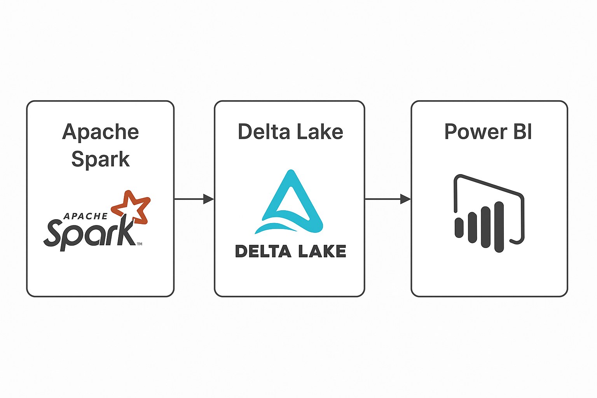

# Data Lakehouse com Databricks, Delta Lake e Power BI

Este projeto tem como objetivo demonstrar a criação de uma arquitetura moderna de dados no estilo Lakehouse, utilizando **Databricks**, **Delta Lake**, e **Power BI**. A proposta é simular um pipeline de ingestão, transformação e análise de dados reais, estruturando um ambiente escalável e voltado para decisões orientadas por dados.

---

## 🔍 Visão Geral

A arquitetura do projeto utiliza o conceito de *Data Lakehouse*, que combina a escalabilidade e o custo-benefício de um Data Lake com a performance e confiabilidade de um Data Warehouse.

Os dados utilizados no projeto são públicos e simulam um ambiente corporativo com foco em análise exploratória e criação de dashboards interativos.

---

## Arquitetura do Projeto

### Diagrama da Solução



---

## Thumbnail do Projeto


---

## Tecnologias Utilizadas

- **Databricks**: plataforma para processamento distribuído de dados.
- **Delta Lake**: formato de armazenamento transacional otimizado para análise de dados.
- **Apache Spark (PySpark)**: motor de processamento distribuído para tratamento e transformação de dados.
- **Power BI**: ferramenta de visualização e exploração dos dados.
- **Azure Data Lake Storage** (opcional): armazenamento de dados brutos.
- **GitHub Actions** (opcional): automação de deploy e versionamento de código.

---

## Estrutura do Projeto

```bash
lakehouse-projeto/
├── notebooks/
│   ├── ingestao_dados.ipynb
│   ├── transformacoes.ipynb
│   └── carga_delta_table.ipynb
├── powerbi/
│   └── dashboard.pbix
├── docs/
│   ├── diagrama.png
│   └── thumbnail.png
└── README.md
```

## Etapas do Projeto

### 📥 Coleta e Ingestão dos Dados

- Utilização de dados públicos via API ou datasets CSV.
- Armazenamento em formato bruto no Data Lake.

### 🔄 Transformação e Organização

- Tratamento dos dados com PySpark.
- Escrita em Delta Lake com versionamento e otimizações.

### 📊 Criação de Tabelas para Consumo

- Leitura das tabelas Delta.
- Otimizações com `OPTIMIZE`, `ZORDER` e `VACUUM`.

### 📈 Visualização e Análise

- Conexão via Power BI.
- Criação de dashboards interativos para análise de KPIs.

---

## Como Rodar o Projeto

### 1. Clone o repositório:

```bash
git clone https://github.com/AlanBReis/datalakehouse-analytics-pipeline.git